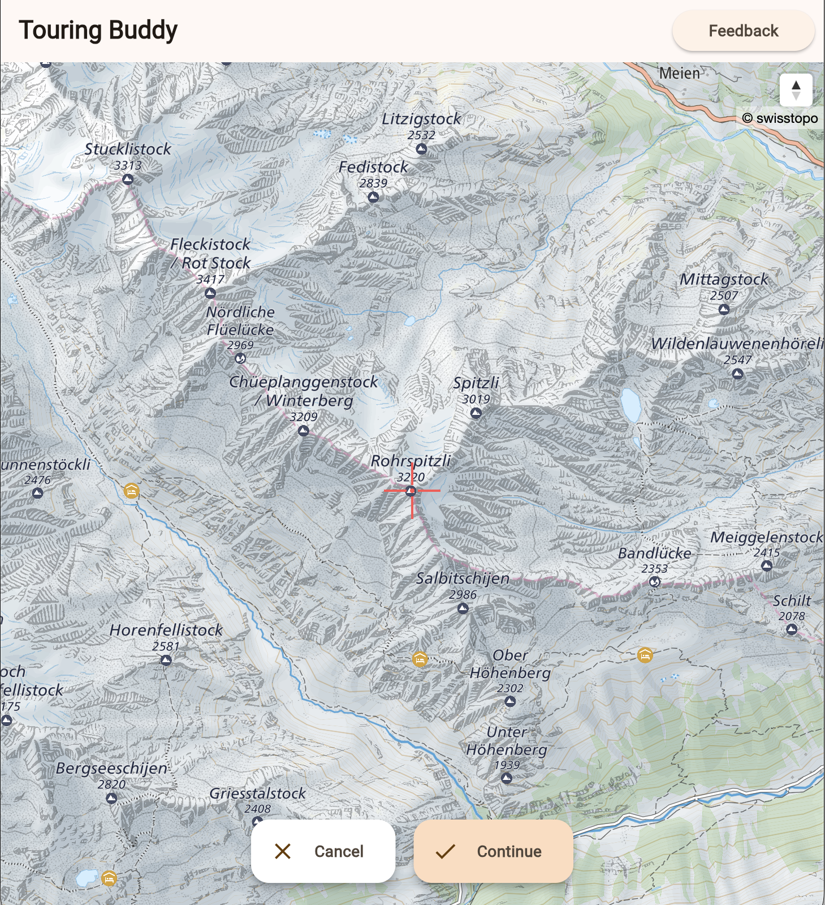
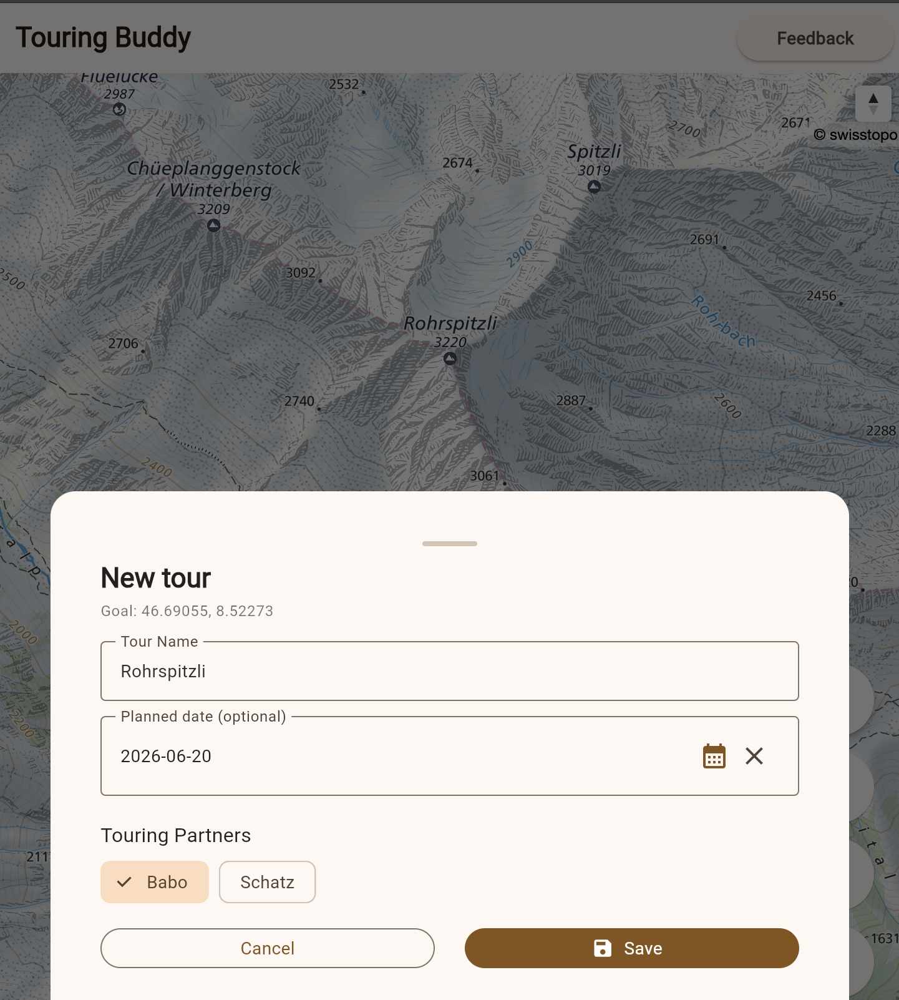
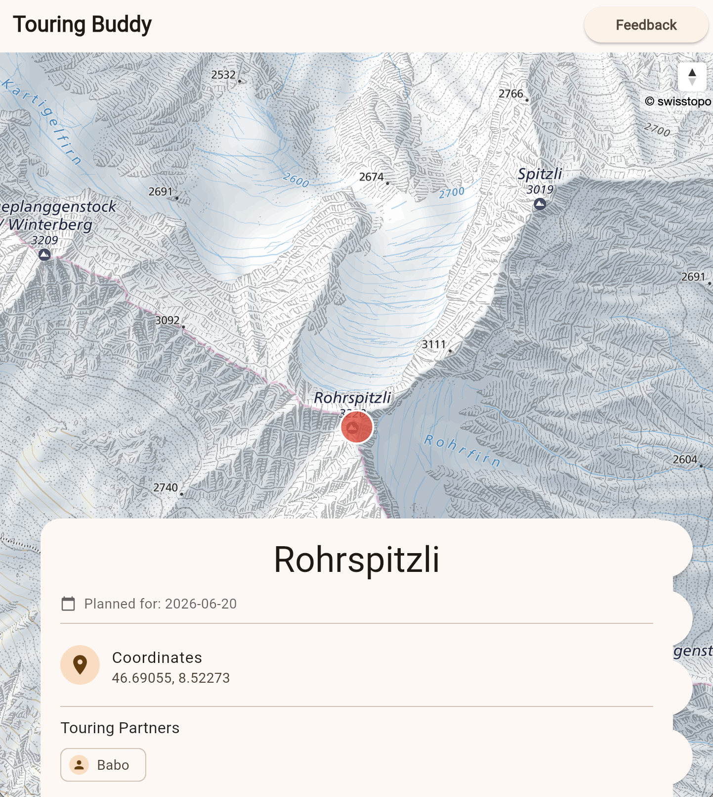

# TouringBuddy Frontend

TouringBuddy is your best buddy for planning tours with your buddies.
Have a go and try it out at [test.tourenbuddy.ch](https://test.tourenbuddy.ch/).

## Description

Most of the time outdoors is spent thinking about where else you could go, what line you could ride, which peak you could summit next, and whom you could do it with.
TouringBuddy aims to help you keep track of your objective and the partners you want to go exploring with.

## Overview

TouringBuddy is built with [Flutter](https://flutter.dev/).
At the moment, the web version is available for beta testing and feedback.
The roadmap includes both an iOS and Android app, as well as the web application for use on Desktop.
To see all the currently planned features, please have a look at the [backlog](https://github.com/users/sekael/projects/1).

## Deployment

The app is tested and built using [Github Actions](https://github.com/sekael/touringbuddy_frontend/actions).

## Local Testing and Development

1. Clone the repository
2. Run `flutter pub get` from the root directory
3. Run `flutter run` and select the target device
4. The app will start in debug mode with hot reload

## Feedback

Your feedback, suggestions, feature requests, and ideas are greatly appreciated.
Please use the feedback button in the test web application or add a [new feedback issue](https://github.com/sekael/touringbuddy_frontend/issues/new?template=beta_feedback.yml) on Github.

### Known Issues

Please check the current [issues](https://github.com/sekael/touringbuddy_frontend/issues) before reporting bugs and feature requests, as there may already be a ticket for it!

The biggest, currently known issues that are under investigation are:

- High latency, low responsiveness of Supabase authentication (probably due to me being cheap and using the free tier with lower limits)
- Swisstopo full color map not displayed on web: https://github.com/sekael/touringbuddy_frontend/issues/24
- Map loading slowly, probably due to throttling between Cloudflare and Swisstopo's tile server

## Contributing

I have many ideas, but only limited time and energy.
You can always open a pull request for one of [ready issues](https://github.com/users/sekael/projects/1/views/1).
Before embarking on the journey to add a larger feature, open a new issue and reach out to me for a quick check-in of how it fits into the roadmap.

### Guidelines for Contributions

- Keep pull requests as small as possible, be mindful of the scope that is still reviewable by a single person
- Follow the guidelines for [conventional commits](https://www.conventionalcommits.org/en/v1.0.0/), this is crucial for automated versioning using [release-please](https://github.com/googleapis/release-please)
- Test your changes locally, add screenshots to the pull request description
- If sensible and not yet done, add unit tests and UI tests

Generating code and using AI for development is OK, as long as you keep your own brain engaged and don't just let loose an AI agent on the code base.
This project is not intended to be another vibe-coding experiment.
Since it will never be monetized and there is no desire to market this app to anyone except those who find it useful and beneficial for planning their freetime, we will not turn it into an arms race of who can generate code the fastest.

### Get More Involved

If you are interested in joining the project, implementing a couple of features or discussing opinions and variants, please reach out to me via [email](mailto:selimkaelin+touringbuddy@proton.me).

## License

Distributed under the [GNU General Public License v3](https://www.gnu.org/licenses/gpl-3.0.txt).
