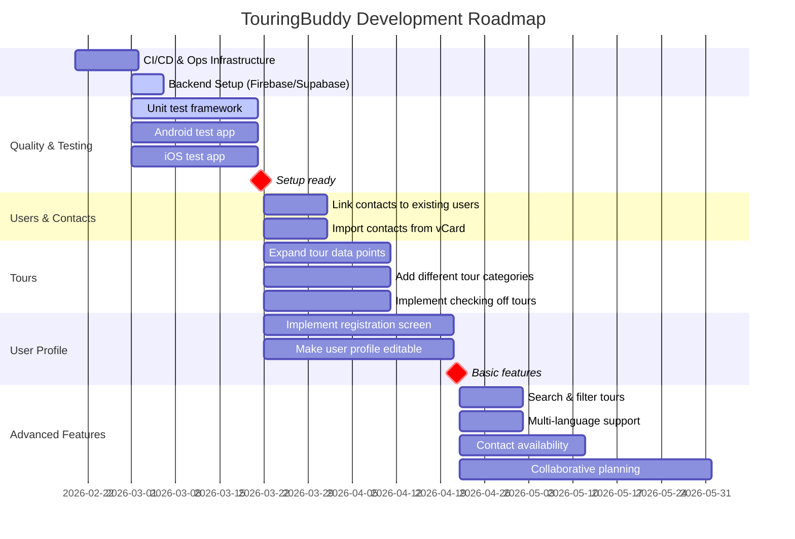

# Roadmap for TouringBuddy

This is a hobby project, none of the data on this roadmap should be understood as binding or actual deadlines.
It is merely a basic overview over what is in store.

```mermaid
gantt
title TouringBuddy Development Roadmap
dateFormat YYYY-MM-DD

    CI/CD & Ops Infrastructure: done f1, 2026-02-20, 10d
    Backend Setup (Firebase/Supabase): active, f2, 2026-03-01, 5d

    section Quality & Testing
    Unit test framework: active, m1, 2026-03-01, 20d
    Android test app: m2, 2026-03-01, 20d
    iOS test app: m3, 2026-03-01, 20d

    Setup ready: milestone, crit, ms1, after m3, 1d

    section Users & Contacts
    Link contacts to existing users: b1, after ms1, 10d
    Import contacts from vCard: b2, after ms1, 10d

    section Tours
    Expand tour data points: t1, after ms1, 20d
    Add different tour categories: t2, after ms1, 20d
    Implement checking off tours: t3, after ms1, 20d

    section User Profile
    Implement registration screen: up1, after ms1, 30d
    Make user profile editable: up2, after ms1, 30d

    Basic features: milestone, crit, ms2, after up2, 1d

    section Advanced Features
    Search & filter tours: af1, after ms2, 10d
    Multi-language support: af2, after ms2, 10d
    Contact availability: af3, after ms2, 20d
    Collaborative planning: af4, after ms2, 40d
```
